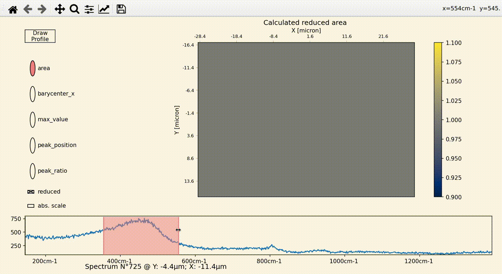

# spectrapy_reduced
A showcase for rapid visualisations of Raman hyperspectral data (preferabley 2D maps or slices, but 1D series should work as well).

You should start by trying to run the `start_here.py` file.

If you want to try it on your files, you should note that it'll only work if you provide the native Renishaw .wdf binary files.

